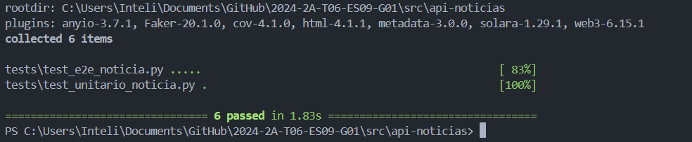
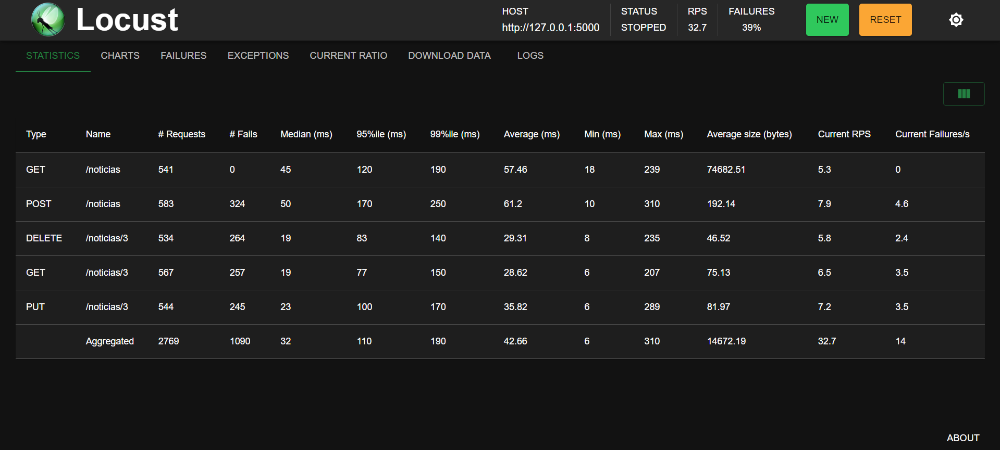
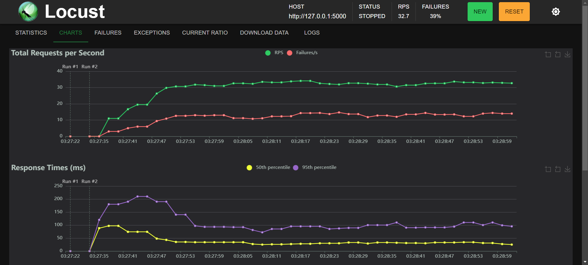
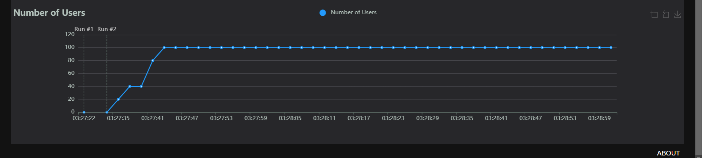
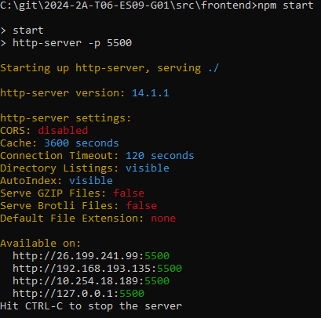
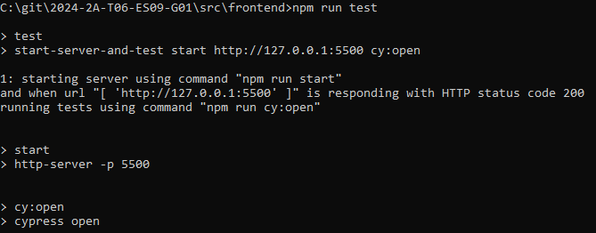
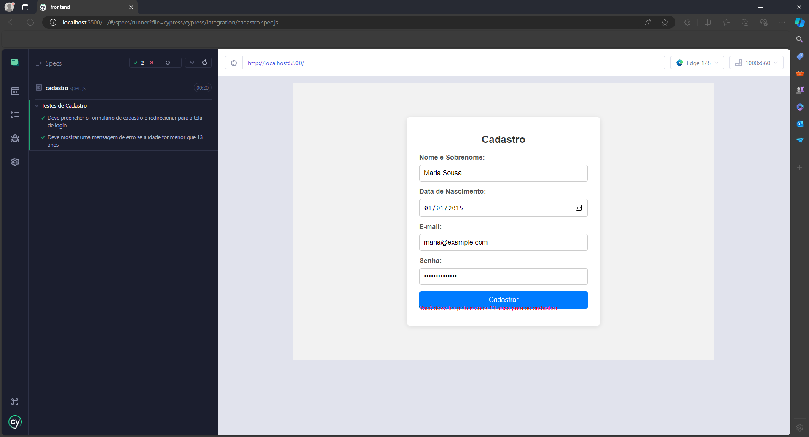
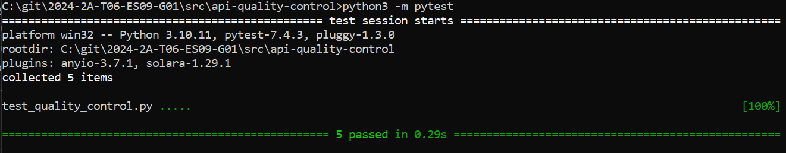

## Sprint 1: Documentação de Testes dos Business Drivers

Nesta sprint, realizamos testes em uma API simulada para medir sua performance e limites. Os testes realizados foram:

- **e2e (end-to-end)**
- **Unitários**
- **Sazonalidade**
- **Volumetria**

### Resultados dos Testes

Após a bateria de testes iniciais, obtivemos o seguinte resultado:

  
*Sucesso em todos os testes*

### Dashboard de Volumetria e Sazonalidade com Locust

Com o Locust, criamos dashboards com dados de volumetria e sazonalidade:





### Localização dos Testes

- Os **testes unitários e e2e** estão disponíveis em: [src/api-noticias/tests](../src/api-noticias/tests)
- Os **testes de sazonalidade e volumetria** estão em: [src/api-noticias/locustfile.py](../src/api-noticias/locustfile.py)

---

## Sprint 2: Modelo ATAM, criação do Front-end e teste e2e

Nesta sprint, o focamos em realizar uma análise aprofundada da arquitetura da Cogny utilizando o modelo ATAM (Architecture Tradeoff Analysis Method). Através desta análise, examinamos o modelo de negócios e a arquitetura técnica da empresa, identificando pontos fortes, fraquezas, oportunidades e ameaças. Com base nos resultados dessa análise, decidimos desenvolver um esboço de uma parte crítica da arquitetura da Cogny que possa agregar valor significativo para a empresa.

O ATAM (Architecture Tradeoff Analysis Method) é um método estruturado para avaliar a arquitetura de um sistema de software, focando na análise de trade-offs entre diferentes atributos de qualidade. Este método permite que equipes identifiquem e avaliem como diferentes decisões arquiteturais afetam atributos como desempenho, modificabilidade, segurança e confiabilidade.

O ATAM segue várias etapas principais:

1. **Apresentação do ATAM**: Introdução ao método e definição dos objetivos da análise.
2. **Apresentação dos Business Drivers**: Identificação dos objetivos de negócio e requisitos principais que o sistema deve atender.
3. **Apresentação da Arquitetura**: Descrição detalhada da arquitetura existente ou planejada do sistema.
4. **Identificação dos Elementos de Arquitetura**: Destacar os componentes críticos e suas interações que sustentam a arquitetura.
5. **Árvore de Atributos de Qualidade**: Estabelecimento de uma hierarquia dos atributos de qualidade, permitindo a priorização dos mesmos.
6. **Análise de Riscos e Não Riscos**: Avaliação de quais decisões arquiteturais representam riscos ou não riscos para os atributos de qualidade.
7. **Brainstorming de Cenários Prioritários**: Discussão e definição de cenários que representem os requisitos de negócio mais críticos.
8. **Análise dos Cenários**: Aplicação dos cenários definidos para testar como a arquitetura suporta os atributos de qualidade identificados.
9. **Apresentação dos Resultados**: Compilação e apresentação dos achados, incluindo recomendações para melhorias ou ajustes na arquitetura.

A aplicação do ATAM na análise da arquitetura da Cogny ajudou a identificar pontos fortes, como a robustez na interação com APIs externas, e fraquezas, como possíveis riscos de performance em cenários de alta demanda. As oportunidades de melhoria, incluindo a otimização de processos para suportar crescimento e escalabilidade.

### Implementação dos Testes de Interface e2e

Após a análise, decidimos implementar uma série de testes de interface e2e para garantir que as funcionalidades críticas do sistema funcionem corretamente sob diferentes cenários. Os testes foram configurados para validar fluxos importantes como login, cadastro, e exibição de notícias, utilizando a ferramenta Cypress para garantir uma cobertura completa dos cenários prioritários identificados no ATAM.

## Instruções para Rodar o Frontend para Testes de Interface e2e

### Navegação até o Diretório do Frontend

Abra o terminal e navegue até o diretório `src/frontend`:

```bash
cd 2024-2A-T06-ES09-G01\src\frontend
```

### Instalação das Dependências

Instale as dependências do projeto:

```bash
npm install
```

### Executando o Servidor Frontend

Para executar o servidor que servirá o `index.html`, use o seguinte comando:

```bash
npm start
```

Este comando iniciará um servidor local na porta 5500 por padrão. Você pode acessar a aplicação no navegador em:  
[http://127.0.0.1:5500/src/frontend/index.html](http://127.0.0.1:5500/src/frontend/index.html)

### Executando os Testes com Cypress

#### Modo Interativo

Para abrir a interface gráfica do Cypress, execute:

```bash
npm run test
```

#### Modo Headless

Para executar os testes no modo headless (sem interface gráfica), use:

```bash
npm run cy:run
```

### Relatórios de Teste

Os relatórios de teste gerados pelo Mochawesome estarão disponíveis na pasta `cypress/reports`.

#### Gerando Relatórios

Os relatórios dos testes são gerados automaticamente após a execução dos testes. Você pode encontrá-los em formato HTML e JSON na pasta `cypress/reports`.

#### Provas de Testes

A execução dos testes é feita primeiro iniciando o frontend:



Depois, é necessário executar o cypress:



Na interface do Cypress basta selecionar seu navegador, então, os testes podem ser visualizados na web:



---

## Estrutura de Testes

- **`integration/`**: Contém testes de integração para o frontend.
  - `cadastro.spec.js`: Testes relacionados ao fluxo de cadastro.
  - `login.spec.js`: Testes relacionados ao fluxo de login.
  - `noticias.spec.js`: Testes relacionados à exibição de notícias.

- **`e2e/`**: Exemplos de testes end-to-end fornecidos pelo Cypress para referência.

- **`fixtures/`**: Dados fictícios usados nos testes.

---

### Customizando Configurações do Cypress

Você pode customizar as configurações do Cypress modificando o arquivo `cypress.config.js` localizado na raiz da pasta `cypress`.


## Sprint 3: Documentação e Diagnóstico de controle de qualidade de Requisitos Não Funcionais

### Introdução:
Para a Sprint 3, nosso objetivo foi realizar testes de carga e desempenho no site da Cogny. A meta era avaliar a robustez do serviço oferecido pela empresa e sua capacidade de lidar com um grande volume de requisições. Também analisamos os requisitos não funcionais descritos no ATAM. Além disso, desenvolvemos uma API que consome a API da Cogny, permitindo-nos implementar e avaliar os seguintes requisitos não funcionais: disponibilidade, tempo de resposta, rastreabilidade, segurança e tolerância a falhas.


## Teste k6
Foi utilizado o k6 para realizar testes de carga em um formulário do Salesforce no site da Cogny (https://www.cogny.co/thankyou). O objetivo foi simular a atividade de 10 usuários virtuais enviando requisições POST simultâneas durante um período de 30 segundos. O script envia dados de teste para o formulário e verifica se as respostas retornam o status 200 (OK), além de imprimir o status e o corpo das respostas no console. Esse teste ajuda a avaliar o desempenho e a capacidade de resposta da aplicação sob carga.

## Resultados dos testes:

### 1° Teste:
Simulação de 10 usuários simultâneos realizando requisições por 30 segundos:

**Configuração do Teste:**
- **Número de Usuários Virtuais (VUs):** 10
- **Duração do Teste:** 30 segundos

**Resultados:**

1. **Status das Requisições:**
   - **Total de Requisições:** 185
   - **Status 200 (Sucesso):** 100%
   - **Requisições Falhas:** 0

2. **Dados Transferidos:**
   - **Dados Recebidos:** 106 kB (3.3 kB/s)
   - **Dados Enviados:** 89 kB (2.8 kB/s)

3. **Tempos de Requisição (médios):**
   - **Tempo de Bloqueio HTTP:** 86.8 ms
   - **Tempo de Conexão HTTP:** 55.49 ms
   - **Duração da Requisição HTTP:** 585.97 ms
     - **Tempo de Espera HTTP:** 553.16 ms
     - **Tempo de Recebimento HTTP:** 32.74 ms
     - **Tempo de Envio HTTP:** 60.54 µs
     - **Tempo de Handshake TLS:** 25.84 ms

4. **Desempenho:**
   - **Requisições por Segundo:** 5.73
   - **Iterações por Segundo:** 5.73
   - **Duração Média da Iteração:** 1.67 s

5. **Distribuição dos Tempos de Requisição:**
   - **Tempo Mínimo de Requisição:** 395.7 ms
   - **Tempo Máximo de Requisição:** 4.83 s
   - **Tempo Mediano de Requisição:** 506.59 ms
   - **Percentil 90:** 540.12 ms
   - **Percentil 95:** 614.75 ms

**Observações:**
- Todas as requisições foram bem-sucedidas, sem falhas.
- O tempo médio de resposta está dentro dos limites aceitáveis, mas o tempo máximo é relativamente alto. Pode ser necessário investigar possíveis gargalos para melhorar a performance.

**Conclusão:**
O sistema foi capaz de lidar com 10 usuários simultâneos sem falhas, com uma média de 585.97 ms para a duração das requisições. No entanto, quando realizamos os teste com aumentando do número de usuários ou/e o tempo de duração, vimos que, todos os testes falharam.

## Relação com o Modelo ATAM

Para o diagnóstico de controle de qualidade dos requisitos não funcionais, foi realizada uma análise detalhada da arquitetura dos serviços oferecidos pela Cogny, utilizando o modelo ATAM (Architecture Tradeoff Analysis Method). A análise focou nos seguintes serviços:

1. **Disponibilidade:**
   - **Análise:** A disponibilidade do sistema foi observada como boa durante o teste, pois todas as requisições foram bem-sucedidas sem falhas. No entanto, a capacidade do sistema para lidar com um número maior de usuários ou um tempo de teste mais longo resultou em falhas, sugerindo que a disponibilidade pode ser impactada sob carga elevada.
   - **Importância:** Alta. A disponibilidade é crucial para garantir que o sistema esteja acessível e funcional quando necessário.

2. **Tempo de Resposta:**
   - **Análise:** O tempo médio de resposta foi de 585.97 ms, com um tempo máximo de 4.83 s. Embora a média esteja dentro dos limites aceitáveis, o tempo máximo relativamente alto indica que podem existir gargalos ou problemas de performance que precisam ser investigados.
   - **Importância:** Alta. O tempo de resposta afeta diretamente a experiência do usuário e a eficiência do sistema.

3. **Rastreabilidade:**
   - **Análise:** A análise não forneceu informações específicas sobre rastreabilidade. É importante verificar se o sistema oferece mecanismos para rastrear e registrar requisições e eventos para facilitar a resolução de problemas e o monitoramento.

4. **Segurança:**
   - **Análise:** Não foram fornecidos dados específicos sobre segurança no teste. É essencial avaliar se o sistema tem mecanismos adequados para proteger dados e garantir a segurança durante as operações.

5. **Tolerância:**
   - **Análise:** A capacidade de tolerar falhas não foi testada diretamente, mas o fato de que o sistema falhou ao aumentar a carga sugere que a tolerância a falhas pode precisar de melhorias. Deve-se investigar como o sistema responde a falhas e como mantém a operação sob condições adversas.

**Conclusão:** A Cogny demonstra um bom desempenho em termos de disponibilidade e tempo de resposta em condições normais, mas enfrenta desafios quando submetida a cargas mais altas. Isso faz com que a empresa possa vir sofrer prejuízos em eventos que há alta demanda de usuários em seus serviços, como por exemplo em dias de jogos.

## Documentação dos testes de controle de qualidade

Nesta seção, será detalhada a documentação dos testes de controle de qualidade, que cobrem funcionalidades críticas relacionadas a vouchers e programas de fidelidade, utilizando Flask como framework web. Além disso, foram implementados testes automatizados usando pytest e a biblioteca unittest.mock para simular diferentes cenários e garantir a robustez da aplicação.

### Código da API Flask para Processar Vouchers e Fidelidade

A API ([presente aqui](../src/api-quality-control/quality_control.py)) foi construída para simular a interação com um serviço Salesforce por meio de endpoints que lidam com a persistência de dados de programas de fidelidade e processamento de vouchers.

### Testes Automatizados
Os testes ([presentes aqui](../src/api-quality-control/test_quality_control.py)) foram projetados para garantir a funcionalidade correta dos endpoints de vouchers e programas de fidelidade. Foram simuladas respostas do serviço externo Salesforce usando patch do unittest.mock.

### Execução
Para executar os testes basta utilizar o comando:

```cmd
python3 -m pytest
```

Imagem x: Evidência de execução dos testes

### Resultados dos Testes

1. Testes de Saúde do Serviço:

 - Endpoint /health: Verifica se a aplicação está em execução e retornando o status correto.

2. Testes de Sucesso para Processamento de Voucher:

 - Simula uma resposta bem-sucedida ao processar um voucher, com status 200 retornado pelo Salesforce.

3. Testes de Sucesso para Persistência de Fidelidade:

 - Verifica se a API é capaz de persistir corretamente dados de fidelidade no Salesforce.

Os testes documentados cobrem cenários de sucesso e falhas de comunicação com o serviço externo, garantindo que a aplicação se comporte corretamente em ambos os casos.


### Testes de predição e prevenção

Os testes de predição e prevenção são fundamentais para antecipar comportamentos suspeitos e evitar incidentes antes que eles ocorram. Esses testes focam em monitorar padrões de uso e identificar anomalias que possam indicar atividades maliciosas ou falhas iminentes no sistema. A partir da análise preditiva, o sistema pode tomar ações preventivas automaticamente, garantindo maior segurança e integridade dos dados.

Na nossa aplicação, a rota /cogny/suspicious_users foi configurada para identificar usuários com comportamento suspeito. Esse endpoint utiliza modelos de machine learning que analisam o histórico de atividades e detectam possíveis riscos. O resultado do teste é uma lista de usuários classificados como "suspeitos", permitindo uma rápida intervenção.

Já o endpoint /cogny/run_prevention é acionado para executar ações de prevenção baseadas nas predições feitas anteriormente. Este endpoint garante que medidas preventivas sejam tomadas automaticamente, como bloqueio de contas comprometidas, restrição de acesso ou reforço de autenticação. A execução dessas ações é registrada e monitorada para garantir que o sistema responda de forma eficaz a qualquer possível ameaça.

Exemplos de uso:

Predição de Usuários Suspeitos: localhost:5000/cogny/suspicious_users

```json
{
    "aqweqweaz": {
        "attempts": [
            {
                "ip_address": "127.0.0.1",
                "timestamp": "2024-09-12T21:47:09.845689"
            }
        ],
        "blocked_ips": []
    },
    "cogny_user": {
        "attempts": [
            {
                "ip_address": "127.0.0.1",
                "timestamp": "2024-09-12T21:46:58.390928"
            },
            {
                "ip_address": "127.0.0.1",
                "timestamp": "2024-09-12T21:46:59.430560"
            },
            {
                "ip_address": "127.0.0.1",
                "timestamp": "2024-09-12T21:47:04.434043"
            },
            {
                "ip_address": "127.0.0.1",
                "timestamp": "2024-09-12T21:47:06.172438"
            }
        ],
        "blocked_ips": []
    }
}
```

Execução de Ações Preventivas: localhost:5000/cogny/run_prevention
```json
{
    "details": {
        "aqweqweaz": {
            "attempts": [
                {
                    "ip_address": "127.0.0.1",
                    "timestamp": "2024-09-12T21:47:09.845689"
                }
            ],
            "blocked_ips": []
        },
        "cogny_user": {
            "attempts": [
                {
                    "ip_address": "127.0.0.1",
                    "timestamp": "2024-09-12T21:46:58.390928"
                },
                {
                    "ip_address": "127.0.0.1",
                    "timestamp": "2024-09-12T21:46:59.430560"
                },
                {
                    "ip_address": "127.0.0.1",
                    "timestamp": "2024-09-12T21:47:04.434043"
                },
                {
                    "ip_address": "127.0.0.1",
                    "timestamp": "2024-09-12T21:47:06.172438"
                }
            ],
            "blocked_ips": []
        }
    },
    "message": "Detectamos algo suspeito!"
}
```
## Sprint 4: Criação do Dashboard e testes de funcionalidade:

## Dashboard

O dashboard foi projetado para monitorar e gerenciar a api (Middleware) da Cogny,  que processa vouchers e dados de fidelidade. Ele utiliza WebSockets para fornecer atualizações em tempo real sobre métricas de desempenho, como uso de CPU e memória, além de registrar erros e estatísticas de requisições.


### 2. Funcionalidades Principais

- **Monitoramento de Métricas**: Captura informações em tempo real sobre o uso de recursos do sistema (CPU e memória) e os tempos de resposta das requisições.
- **Registro de Erros**: Registra erros encontrados nas requisições e suas frequências, permitindo análise e melhoria contínua.
- **Conexão em Tempo Real**: Utiliza Flask-SocketIO para emitir métricas atualizadas a cada segundo para os clientes conectados.
- **Endpoints de API**:
  - `/health`: Verifica se o serviço está em execução.
  - `/restHelper/processVoucher`: Processa vouchers e registra métricas.
  - `/restHelper/persistLoyalty`: Persiste dados de fidelidade e registra métricas.
  - `/metrics`: Agrega e fornece métricas registradas no arquivo de log.

### 3. Design e Estrutura

O dashboard é construído com Flask e utiliza bibliotecas como Flask-SocketIO para comunicação em tempo real e psutil para monitoramento de recursos. O código é estruturado em funções que gerenciam as operações principais, como processamento de vouchers e persistência de dados.

### 4. Tecnologias Utilizadas

- **Flask**: Framework web leve para Python.
- **Flask-SocketIO**: Permite comunicação em tempo real entre o servidor e o cliente.
- **Flask-CORS**: Habilita requisições cross-origin.
- **psutil**: Fornece informações sobre o uso de recursos do sistema.
- **requests**: Biblioteca para realizar requisições HTTP.

## Implementações

### 1. Funções Principais

- **create_app()**: Cria e configura a aplicação Flask.
- **update_resource_usage()**: Retorna a utilização atual de CPU e memória.
- **log_metrics(metrics)**: Registra as métricas em um arquivo de log e emite eventos de atualização para os clientes.
- **process_voucher()**: Roteamento que processa um voucher, registrando métricas e gerenciando erros.
- **persist_loyalty()**: Roteamento que persiste dados de fidelidade, registrando métricas e gerenciando erros.
- **get_metrics()**: Agrega métricas do arquivo de log e retorna como resposta.

### 2. Estrutura dos Endpoints

#### Endpoint `/restHelper/processVoucher`
- Método: POST
- Função: Processa um voucher e registra métricas de desempenho.
- Respostas:
  - 200: Voucher processado com sucesso.
  - 500: Falha ao processar o voucher.

#### Endpoint `/restHelper/persistLoyalty`
- Método: POST
- Função: Persiste dados de fidelidade e registra métricas de desempenho.
- Respostas:
  - 200: Dados de fidelidade persistidos com sucesso.
  - 500: Falha ao persistir dados de fidelidade.

#### Endpoint `/health`
- Método: GET
- Função: Verifica se o serviço está em execução.
- Resposta: 200: Serviço em execução.

#### Endpoint `/metrics`
- Método: GET
- Função: Agrega métricas do arquivo de log e retorna como resposta.
- Resposta: 200: Métricas agregadas.

## Documentação dos Testes

### 1. Estrutura de Testes

Os testes são realizados utilizando `pytest` e `unittest.mock` para simular requisições e verificar o comportamento da aplicação sem depender de serviços externos.

### 2. Testes Implementados

#### Teste de Verificação de Saúde
```python
def test_health_check(client):
    response = client.get('/health')
    assert response.status_code == 200
    assert response.json == {"status": "Service running"}
```
- **Descrição**: Verifica se o endpoint de saúde retorna um status 200.

#### Teste de Processamento de Voucher com Sucesso
```python
@patch('requests.post')
def test_process_voucher_success(mock_post, client):
    mock_post.return_value.status_code = 200
    mock_post.return_value.json.return_value = {"status": "Voucher processed"}
    ...
```
- **Descrição**: Simula uma requisição bem-sucedida ao processar um voucher.

#### Teste de Processamento de Voucher com Falha
```python
@patch('requests.post')
def test_process_voucher_redundancy(mock_post, client):
    mock_post.side_effect = [requests.exceptions.ConnectionError, ...]
    ...
```
- **Descrição**: Verifica o comportamento ao ocorrer um erro de conexão.

#### Teste de Persistência de Lealdade com Timeout
```python
@patch('requests.post')
def test_persist_loyalty_substitution(mock_post, client):
    mock_post.side_effect = [requests.exceptions.Timeout, ...]
    ...
```
- **Descrição**: Testa a persistência de dados de lealdade em caso de timeout.

#### Teste de Persistência de Lealdade com Sucesso
```python
@patch('requests.post')
def test_persist_loyalty_prediction_prevention(mock_post, client):
    mock_post.return_value.status_code = 200


### Sprint 5: Storytelling, apresentação e Dashboard

**Sprint 1: Documentação de Testes dos Business Drivers**

Na primeira sprint, o foco foi testar uma **API simulada** para garantir a robustez de seus principais componentes. Implementamos **testes end-to-end (e2e)**, **unitários**, além de **testes de volumetria e sazonalidade**, com o objetivo de identificar possíveis falhas sob condições de carga.

**Resultados:**
- Todos os testes foram executados com **sucesso**.
- Utilizando o Locust, criamos **dashboards interativos**, exibindo o comportamento da API sob diferentes condições de uso.
- Os relatórios revelaram que o sistema poderia suportar cargas moderadas sem impactar a performance.

A organização dos testes foi clara e eficiente, permitindo uma rápida identificação de possíveis problemas:
- Testes unitários e e2e em `src/api-noticias/tests`.
- Testes de volumetria e sazonalidade armazenados em `src/api-noticias/locustfile.py`.

**Sprint 2: Análise ATAM e Testes e2e no Front-end**

Durante essa sprint, realizamos uma **análise de arquitetura** com o método ATAM, identificando **pontos fortes** e **fraquezas** na interação com APIs externas, além de potenciais gargalos de performance. Com base nessas descobertas, aprimoramos a arquitetura da Cogny para otimizar seu desempenho.

**Resultados:**
- Implementamos testes **e2e no front-end** com Cypress, simulando fluxos críticos como login e cadastro.
- A execução dos testes foi bem-sucedida, confirmando que o sistema estava operando como esperado, mesmo em condições de uso intenso.

Além disso, a análise ATAM identificou áreas de melhoria para garantir **resiliência** e **performance** em cenários de alta demanda.


**Sprint 3: Diagnóstico de Requisitos Não Funcionais e Testes de Carga com k6**

Nesta fase, testamos os **requisitos não funcionais**, como a capacidade do sistema de suportar grandes volumes de usuários. Utilizamos o **k6** para simular até **10.000 requisições simultâneas** enviadas a um formulário Salesforce, a fim de avaliar o comportamento da aplicação sob alta carga.

**Resultados:**
- O sistema foi capaz de lidar bem com uma carga moderada, mas mostrou **gargalos significativos** ao aumentar o número de requisições simultâneas e o tempo de teste.
- Descobrimos que, em picos de uso, o sistema atingia o limite de **tempo de resposta** aceitável, revelando áreas que necessitavam de otimizações para garantir escalabilidade.

Com base nesses resultados, realizamos outra análise ATAM, refinando a arquitetura para melhorar a **disponibilidade** e **resposta sob alta carga**.

**Sprint 4: API Flask e Testes Automatizados**

A última sprint foi dedicada ao desenvolvimento de uma **API Flask** para processar vouchers de fidelidade. Essa API se conectava com a solução da Cogny, e era fundamental testar sua integração com **Salesforce**.

**Resultados:**
- Implementamos testes automatizados com **pytest** e **unittest.mock**, que simularam cenários de sucesso e falha. Esses testes validaram a **resiliência** do sistema diante de diferentes condições de uso.
- Através da automação, reduzimos o tempo de resposta ao detectar bugs, aumentando a **eficiência** no desenvolvimento e garantindo maior **confiabilidade**.
