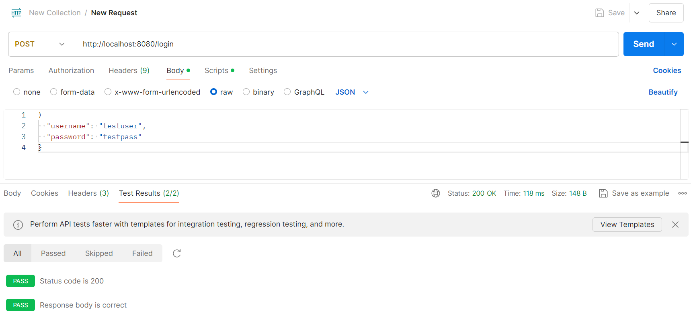

### API LOGIN


### **Teste de Volumetria e Sazonalidade**


#### **Objetivo do Teste:**
O objetivo do teste de volumetria é avaliar o comportamento da aplicação sob uma carga controlada de 100 usuários simultâneos, verificando métricas de desempenho como latência, taxa de requisições por segundo (RPS) e taxa de falhas.

---

#### **Ferramentas Utilizadas:**
- **Locust**: Utilizado para simular os usuários e executar as requisições HTTP.
- **Go (Golang)**: Servidor da aplicação sendo testada.
- **Endpoint Testado**: `http://localhost:8080/login`

---

#### **Configuração do Teste:**

1. **Script de Teste:** Arquivo `locust.py` com as seguintes definições:
   - Simulação de usuários acessando o endpoint `/login`.
   - Payload de login:
     ```json
     {
       "username": "testuser",
       "password": "testpass"
     }
     ```
   - Tempo de espera entre as tarefas: Entre 1 e 2 segundos.
   
2. **Execução:**
   - O servidor foi iniciado utilizando o comando `go run main.go`.
   - O teste de carga foi iniciado com o comando:
     ```bash
     locust -f locust.py --host=http://localhost:8080
     ```

---

#### **Resultados do Teste:**


- **Usuários Simulados**: 100
- **Taxa de Requisições por Segundo (RPS)**: 61.9
- **Falhas**: 0%

##### **Métricas de Desempenho do Endpoint `/login`:**
| Métrica           | Valor       |
|-------------------|-------------|
| Número de Requisições | 5354        |
| Número de Falhas     | 0           |
| Mediana de Latência  | 110 ms      |
| Latência Percentil 95| 120 ms      |
| Latência Percentil 99| 120 ms      |
| Latência Média      | 112.17 ms   |
| Latência Mínima     | 97 ms       |
| Latência Máxima     | 144 ms      |
| Tamanho Médio da Resposta | 31 bytes  |
| Requisições por Segundo | 61.9       |

---

#### **Conclusão:**
O teste de volumetria com 100 usuários simultâneos mostrou que o sistema é capaz de lidar com uma carga de aproximadamente 61.9 requisições por segundo, sem falhas. A latência média ficou em 112.17 ms, com um tempo de resposta bem distribuído.

### Obs:
Realizamos os teste com um número baixo de requisições, com o objetivo ter um resultado rapido para melhor análise.

Aqui está a documentação no estilo que você descreveu, adaptada para os testes unitários realizados:

---

### **Teste Unitário da Função `loginHandler`**

#### **Objetivo do Teste:**
O objetivo dos testes unitários é garantir que a função `loginHandler` se comporte corretamente para diferentes tipos de requisições HTTP, validando as respostas para cenários de login válidos e inválidos, além de métodos não suportados.

---

#### **Ferramentas Utilizadas:**
- **Go (Golang)**: Linguagem utilizada para implementar a função `loginHandler` e executar os testes unitários.
- **Pacote `testing` do Go**: Ferramenta utilizada para a criação e execução dos testes unitários.

---

#### **Configuração do Teste:**

1. **Script de Teste:** Arquivo `main_test.go` com as seguintes definições:
   - Teste para requisições POST válidas, enviando um payload JSON com `username` e `password`.
   - Teste para requisições POST com dados inválidos (campos vazios).
   - Teste para métodos não suportados (requisições GET no endpoint `/login`).

2. **Execução:**
   - Os testes foram executados com o comando:
     ```bash
     go test -v
     ```

---

#### **Resultados do Teste:**


- **Número de Testes Executados**: 3
- **Testes Passados**: 3
- **Testes Falhados**: 0

##### **Detalhes dos Testes Unitários:**

| Teste                           | Resultado |
|---------------------------------|-----------|
| TestLoginHandler_Success        | Passou     |
| TestLoginHandler_InvalidRequest | Passou     |
| TestLoginHandler_MethodNotAllowed | Passou   |

---

#### **Conclusão:**
Os testes unitários realizados confirmaram que a função `loginHandler` se comporta corretamente para todos os cenários testados. A função lida adequadamente com requisições válidas e inválidas, e responde corretamente para métodos não suportados.

### Obs:
Os testes foram realizados para verificar a funcionalidade básica da função `loginHandler`. Para uma análise mais completa, testes adicionais podem ser realizados para cenários mais complexos e casos extremos.

Aqui está o formato para documentar o teste end-to-end (E2E) da API:

---

### **Teste End-to-End (E2E)**

#### **Objetivo do Teste:**
O objetivo do teste E2E é validar a funcionalidade completa do endpoint `/login`, garantindo que a aplicação se comporte conforme esperado em um cenário realista de interação com a API. Isso inclui a verificação do fluxo de autenticação e da integridade da resposta da API.

---

#### **Ferramentas Utilizadas:**
- **Postman**: Utilizado para executar as requisições HTTP e verificar as respostas da API.
- **Go (Golang)**: Servidor da aplicação sendo testada.
- **Endpoint Testado**: `http://localhost:8080/login`

---

#### **Configuração do Teste:**


1. **Requisição de Teste:** A seguir estão os detalhes da requisição POST que foi enviada ao endpoint `/login`:
   - **URL:** `http://localhost:8080/login`
   - **Método:** POST
   - **Payload:** 
     ```json
     {
       "username": "testuser",
       "password": "testpass"
     }
     ```
   - **Cabeçalhos:** 
     - `Content-Type`: `application/json`

2. **Execução:**
   - O servidor foi iniciado utilizando o comando `go run main.go`.
   - O teste foi realizado utilizando o Postman com a configuração acima.

---

#### **Resultados do Teste:**



- **Status da Requisição:** 200 OK
- **Tempo de Resposta:** 106 ms
- **Corpo da Resposta:** 
  ```json
  {
    "message": "Login successful"
  }
  ```

##### **Testes Realizados:**

- **Teste de Status Code:** Verifica se o status code da resposta é 200 OK.
- **Teste de Corpo da Resposta:** Verifica se a mensagem da resposta é "Login successful".

##### **Exemplo de Testes no Postman:**

```javascript
pm.test("Status code is 200", function () {
    pm.response.to.have.status(200);
});

pm.test("Response body is correct", function () {
    const jsonData = pm.response.json();
    pm.expect(jsonData.message).to.eql("Login successful");
});
```

---

#### **Conclusão:**
O teste end-to-end confirmou que o endpoint `/login` está funcionando conforme esperado. A resposta da API corresponde ao esperado para o cenário de login válido, com o status code e corpo da resposta corretos.

### Obs:
Os testes E2E foram realizados para garantir que a integração entre o cliente e o servidor está funcionando corretamente. Testes adicionais podem ser realizados para diferentes cenários de login, incluindo casos com dados inválidos e outros fluxos de autenticação.

Ótimo, você tem um link para o repositório! Se você ainda não fez isso, você pode adicionar as instruções que discutimos no `README.md` do seu repositório. Aqui está um exemplo atualizado para o `README.md` com base no link que você forneceu:

## Requisitos para rodar a API de LOGIN

- Go versão 1.X ou superior
- Python versão 3.X ou superior
- Locust

## Instalação

### Clonar o Repositório

Clone o repositório para seu ambiente local:

```bash
git clone https://github.com/Inteli-College/2024-2A-T06-ES09-G01.git
```

### Navegar para o Diretório do Projeto

```bash
cd 2024-2A-T06-ES09-G01
```

### Configurar e Executar o Servidor Go

1. Navegue até o diretório `src/api-login`:

    ```bash
    cd src/api-login
    ```

2. Baixe as dependências e execute o servidor Go:

    ```bash
    go run main.go
    ```

   O servidor deve estar rodando na porta 8080.

### Configurar e Executar o Locust

1. Certifique-se de que você tem o Locust instalado. Se não, instale-o usando pip:

    ```bash
    pip install locust
    ```

2. Navegue até o diretório onde está o arquivo `locust.py`:

    ```bash
    cd src/api-login
    ```

3. Execute o Locust:

    ```bash
    locust -f locust.py --host=http://localhost:8080
    ```

   A interface web do Locust estará disponível em `http://localhost:8089`.

## Testando

1. Abra o navegador e acesse a interface web do Locust em `http://localhost:8089`.
2. Configure o número de usuários virtuais e a taxa de geração de requisições de acordo com seus requisitos de teste.
3. Inicie o teste e monitore o desempenho da API através da interface do Locust.

